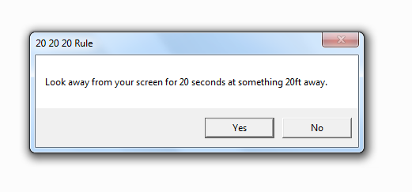

## 20 20 20 Rule for eyes

### What is the 20 20 20 Rule? 

Many of us have jobs that involve looking at a computer screen for hours. This puts strain on our eyes and may cause dry eyes, blurred vision or headaches. Hence the 20 20 20 rule says one should take a 20 seconds break after working for 20 minutes and look at something 20 ft. away.

This VBScript will remind you with a pop-up after every 20 minutes of working to take a break. You can run it easily on any windows system using steps below.

### How to use it?

- Download and run the main.vbs file. 
- The popup window will appear for first time. 
- When you click on 'Yes' it will go in sleep for 20 minutes to come back up for the next reminder.
- When you click on 'No' it will kill the script and it won't disturb you.

### Feedback
- Email - prashantns9@gmail.com
- Website - https://www.prashantshinde.in

### Please follow on Github if you like my work
